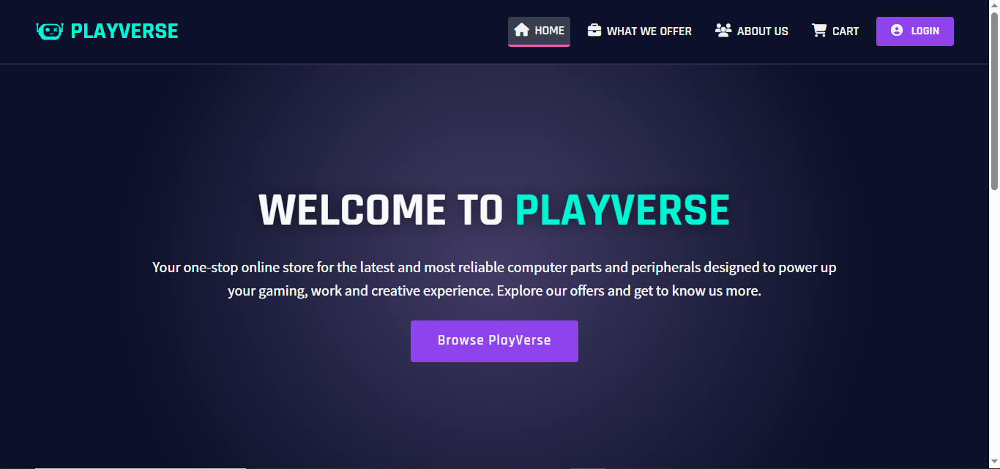

# PlayVerse

PlayVerse is a web application for browsing and purchasing computer parts and peripherals. It runs locally using XAMPP and MySQL, providing a user-friendly interface for registration, login, shopping, and order management.

---

## Setup Instructions

1. **Install XAMPP**  
   Download and install XAMPP from [https://www.apachefriends.org/index.html](https://www.apachefriends.org/index.html).

2. **Start Apache and MySQL**  
   Open the XAMPP Control Panel and start both Apache and MySQL services.

3. **Copy the Project**  
   Place the `PlayVerse` folder inside your `htdocs` directory (e.g., `C:\xampp\htdocs\PlayVerse`).

4. **Import the Database**

    - Open [phpMyAdmin](http://localhost/phpmyadmin).
    - Create a new database named `PlayVerse`.
    - Import the provided `playverse.sql` file into this database.

5. **Configure Database Connection**

    - By default, the PHP files connect to MySQL with user `root` and no password.
    - If you use a different username/password, update the connection details in each PHP file (e.g., `index.php`, `offers.php`, etc.).

6. **Access the Application**
    - Visit [http://localhost/PlayVerse](http://localhost/PlayVerse) in your browser.

---

## Login Information

To access the application:

-   Go to the [Login page](http://localhost/PlayVerse/login.php).
-   Enter your username and password to log in.
-   If you do not have an account yet, click the Register link on the login page and fill out the registration form to create a new account.

---

## Screenshots

-   
-   
-   
-   
-   
-   
-   
-   
-   
-   

---

## File Descriptions

| File/Folder     | Description                                                         |
| --------------- | ------------------------------------------------------------------- |
| `index.php`     | Homepage. Shows welcome message and promotions.                     |
| `offers.php`    | Displays all products, sorting, and add-to-cart functionality.      |
| `product.php`   | Shows detailed info for a single product and allows adding to cart. |
| `register.php`  | User registration form with validation.                             |
| `login.php`     | User login page to fully access the website                         |
| `logout.php`    | Logs out the user and ends the session.                             |
| `cart.php`      | Shows the user's added cart items as well as the Subtotal           |
| `about.php`     | About Us page with company info and contact form.                   |
| `welcome.php`   | User dashboard/profile page after registration/login.               |
| `thankyou.php`  | Order confirmation page after successful checkout.                  |
| `playverse.sql` | SQL file to set up the MySQL database and tables with sample data.  |
| `imgs/`         | Contains all images used in the site (products, logo, etc.).        |
